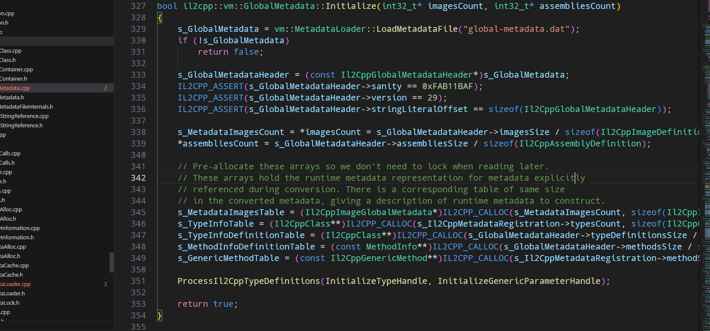
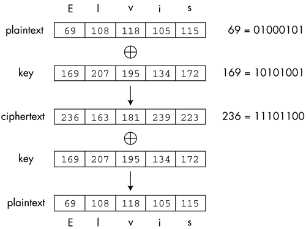
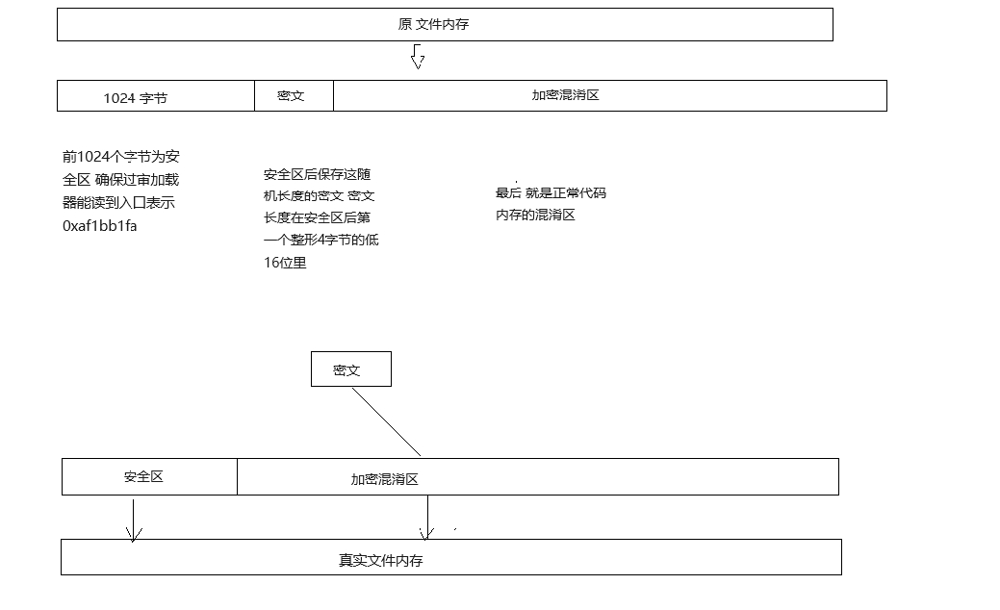
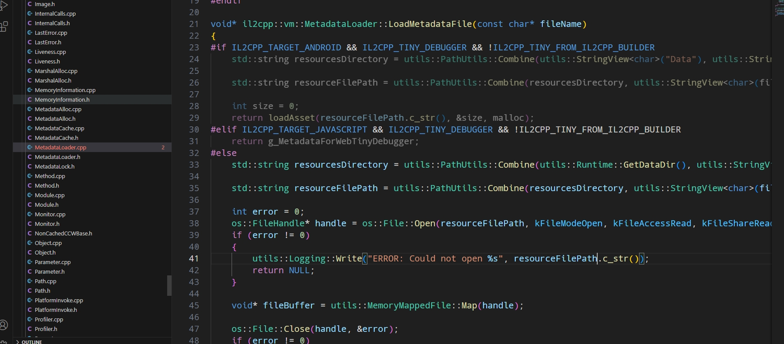
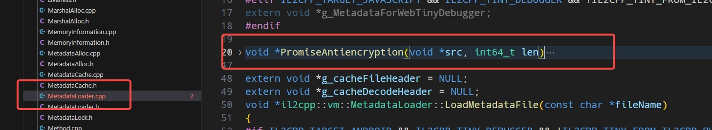
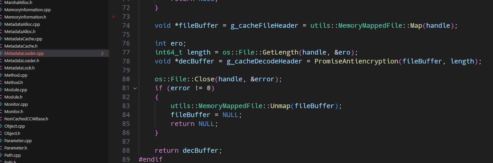

# Unity Global-metadata 源码映射文件加密

## Unitypackage download

[./plugins/EasyObfuscation.unitypackage](./plugins/EasyObfuscation.unitypackage)

### 使用方法

导入Unitypackage到项目中 输出Android工程打包 即可


### 验证加密是否成功

> 使用Il2CppDumper 检查是否能被破解

[bilibili 视频教程](https://www.bilibili.com/video/BV1CQ4y137Gs/?vd_source=144e0a15a312c88bfe222df707be48d5)

## global-metadata.dat是什么？

在Unity引擎中，global-metadata.dat是一种元数据文件，包含了编译后的IL代码所需要的所有信息，包括类型信息、方法信息、字段信息等等。它是一种二进制文件，通常保存在Unity工程的Data文件夹下的il2cpp目录中。

### global-metadata.dat的作用

global-metadata.dat文件的作用是为了在运行时将IL代码转换为C++代码。IL2CPP（Intermediate Language to C++）是一种Unity引擎的构建选项，它可以将C#代码编译为IL代码，然后再将IL代码转换为C++代码，从而提高游戏的性能和安全性。

在转换过程中，global-metadata.dat文件是非常重要的，它包含了编译后的IL代码所需要的所有信息。IL2CPP将global-metadata.dat文件中的元数据信息与转换后的C++代码进行关联，使得C++代码可以在运行时正确地调用和访问IL代码。

### global-metadata.dat的底层原理

在Unity引擎中，global-metadata.dat文件的生成是通过IL2CPP工具链完成的。IL2CPP将编译后的IL代码解析成一个个结构体，这些结构体包含了IL代码的类型信息、方法信息、字段信息等等。然后，IL2CPP将这些结构体存储到一个二进制文件中，即global-metadata.dat文件。

在运行时，IL2CPP会将global-metadata.dat文件加载到内存中，并将元数据信息与转换后的C++代码进行关联。当C++代码需要访问IL代码的类型信息、方法信息、字段信息等等时，IL2CPP会根据global-metadata.dat文件中的元数据信息，从内存中获取相应的信息，并将其转换为C++代码。

### 反编译和修改

Global-metadata.dat文件也可以被反编译，以获取游戏项目的元数据信息。这对于游戏开发者和研究人员来说是非常有用的，因为他们可以在不需要访问代码的情况下了解游戏的结构和实现细节。不过需要注意的是，修改Global-metadata.dat文件可能会导致游戏的运行出现问题或不正常，因此除非有必要，一般不建议修改。

下方我们看下Global-metadata.dat在Unity当中的调用。

我们看到MetadataCache的Initialize()接口调用了这个文件，而这个接口的调用时机就是游戏启动的时候，然后Initialize接口就会解析这个文件的信息，然后缓存起来供后续使用。

### Global-metadata.dat文件的安全性

由于Global-metadata.dat文件包含了游戏项目的元数据信息，因此它也包含了一些敏感信息，如类名、方法名等。这些信息可以被黑客用来进行反编译和破解游戏，因此需要注意保护文件的安全性。

一般来说，Unity引擎会将Global-metadata.dat文件加密，以防止它被直接访问和修改。只有在运行时，引擎才会将文件解密并加载到内存中。这种加密方式可以一定程度上保护文件的安全性，但并不能完全防止黑客的攻击。因此，游戏开发者还需要在代码层面上进行安全措施，如加密敏感信息、限制代码访问等

## 加密方案 

### unity打包后 global-metadata.dat 去哪了？ 

输出Android工程路径\\unityLibrary\\src\\main\\assets\\bin\\Data\\Managed\\Metadata\\global-metadata.dat

### 如何监听unity打包事件? 输出Android工程路径怎么获取 ?

扩展IPostprocessBuildWithReport接口

案例

```csharp
public class MyCustomBuildProcessor : IPostprocessBuildWithReport
{
    int IOrderedCallback.callbackOrder { get { return 0; } }

void IPostprocessBuildWithReport.OnPostprocessBuild( BuildReport report )
{

    //输出打包后的Android工程路径
    Debug.Log( report.summary.outputPath );
}
}
```

### 拿到global-metadata.dat后怎么加密

使用异或特性对二进制文件进行加密


```cpp
std::string Encrypt(std::string content, std::string secretKey)
{
    for (UINT i = 0; i < content.length(); i++)
    {
        content[i] ^= secretKey[i % secretKey.length()];
    }
 
    return content;
}
 
std::string Decrypt(std::string data, std::string secretKey)
{
    for (UINT i = 0; i < data.length(); i++)
    {
        data[i] ^= secretKey[i % secretKey.length()];
    }
 
    return data;
}
```

### 加密案例

> 调用EncryptionCode函数并传入Android工程路径 对global-metadata文件进行加密混淆

**案例加密方式图解**


```cpp

char* encrtypt_file(char* src, size_t& file_size) {

	//随机密钥长度
	uniform_int_distribution<int> key_distrib(130, 140);
	int kl = key_distrib(s_randomEngine);

	//随机密钥的数组指针
	unsigned int* p_passwordArr = new unsigned int[kl];
	for (int i = 0; i < kl; i++)
	{
		p_passwordArr[i] = get_random_uint();
	}

	//加密区长度 单位：int指针
	int klsize = (kl + 1) * sizeof(uint32_t);
	const int safe_size = 1024;//安全区大小
	//加密区大小
	const size_t encrtypt_size = file_size - safe_size;
	//申请一个新的内存卡 它将包含密码和源文件
	char* des = (char*)malloc(file_size + klsize);
	//将安全区代码Cpy到新的内存块
	memcpy(des, src, safe_size);

	//密文区指针
	unsigned int* da = (unsigned int*)(des + safe_size);
	//加密源码区指针
	unsigned int* db = (unsigned int*)(src + safe_size);
	//密文区首四个字节低十六位为加密密文数组长度
	*(da++) = (get_random_uint() & 0xFFFF0000) | (kl & 0xFFFF);
	//写入密码组
	memcpy(da, p_passwordArr, kl * sizeof(uint32_t));
	//指向加密区
	da += kl;

	for (size_t i = 0; i < encrtypt_size; i += 4) {
		int index = (i + (i / kl)) % kl;
		da[i / 4] = p_passwordArr[index] ^ db[i / 4];
	}

	file_size += klsize;
	delete[] p_passwordArr;
	return des;
}

void EncryptionCode(char* export_android_path)
{
	//wait input
	string global_metadata_path = export_android_path;
	if (NULL == strstr(global_metadata_path.c_str(), "global-metadata.dat")) {
		global_metadata_path += "\\unityLibrary\\src\\main\\assets\\bin\\Data\\Managed\\Metadata\\global-metadata.dat";
	}

	//cheack file vaild
	if (!file_exist(global_metadata_path.c_str())) {
		Log("file not found: %s\n", global_metadata_path);
		return;
	}

	Log("EasyObfuscation version: %s", version);

	//load file
	ifstream infile(global_metadata_path, ios::in | ios::binary | ios::ate);
	size_t size = infile.tellg();
	infile.seekg(0, ios::beg);
	char* buffer = new char[size];
	infile.read(buffer, size);
	infile.close();

	//encrtypt
	size_t srcsize = size;
	char* encbuffer = encrtypt_file(buffer, size);
	ofstream outfile(global_metadata_path, ios::out | ios::binary | ios::ate);
	if (!outfile) {
		Log("open file fail: %s\n", global_metadata_path);
		return;
	}

	//log
	unsigned int* hex_buffer = (unsigned int*)buffer;
	unsigned int* hex_encbuffer = (unsigned int*)encbuffer;
	unsigned int src_value = get_little_endian(*hex_buffer);
	unsigned int enc_value = get_little_endian(*hex_encbuffer);
	Log("src: %x\tsrc buffer size: %ld\nenc: %x\tenc buffer size: %ld", src_value, srcsize, enc_value, size);

	outfile.write(encbuffer, size);
	outfile.close();
	delete[] buffer;
	free(encbuffer);

	Log("call cpp complete.");
}
```

### 修改unity引擎il2cpp源码 加载并还原真实文件内存

> 我们需要修改 MetadataLoader.cpp 文件 
> 对fileBuffer文件进行加工处理
> MetadataLoader.cpp路径 C:\Program Files\Unity\Hub\Editor\2021.3.22f1\Editor\Data\il2cpp\libil2cpp\vm
> unity的安装路径下\Editor\Data\il2cpp\libil2cpp\vm


-------

#### 第一步 先实现解密方法



```cpp
void *PromiseAntiencryption(void *src, int64_t len)
{

    char *cp_src = (char *)src; // 以字节流形式访问文件内存buffer
    const int safe_size = 1024; // 安全区大小
    // 机密区首四个字节低十六位为加密密文数组长度
    unsigned int *ip_mask = (unsigned int *)(cp_src + safe_size);
    // 获取加密区掩码数组长度
    int kl = (int)((*ip_mask) & 0xffff);
    // 获取加密代码长度
    const int64_t code_segment_size = len - sizeof(uint32_t) * (kl + 1);
    const int64_t code_encryption_size = code_segment_size - safe_size;
    // 计算真实代码的内存映射长度并申请一块新的内存块
    char *buffer = (char *)malloc(code_segment_size);
    // 将安全区代码Copy到新的内存块中
    memcpy(buffer, cp_src, safe_size);
    // 获取代码区地址指针
    unsigned int *ip_data = (unsigned int *)(buffer + safe_size);
    unsigned int *t = ip_mask + 1;//密文数组指针
    unsigned int *d = ip_mask + kl + 1;//加密区地址指针
    // 反加密处理
    for (int64_t i = 0; i < code_encryption_size; i += 4)
    {
        *(ip_data + i / 4) = (*(t + ((i + (i / kl)) % kl))) ^ (*(d + i / 4));
    }
    return (void *)buffer;
}
```

#### 第二步 调用



### 完整MetadataLoader源码

```cpp
#include "il2cpp-config.h"
#include "MetadataLoader.h"
#include "os/File.h"
#include "os/Mutex.h"
#include "utils/MemoryMappedFile.h"
#include "utils/PathUtils.h"
#include "utils/Runtime.h"
#include "utils/Logging.h"

#if IL2CPP_TARGET_ANDROID && IL2CPP_TINY_DEBUGGER && !IL2CPP_TINY_FROM_IL2CPP_BUILDER
#include <stdlib.h>
extern "C"
{
    void *loadAsset(const char *path, int *size, void *(*alloc)(size_t));
}
#elif IL2CPP_TARGET_JAVASCRIPT && IL2CPP_TINY_DEBUGGER && !IL2CPP_TINY_FROM_IL2CPP_BUILDER
extern void *g_MetadataForWebTinyDebugger;
#endif

void *PromiseAntiencryption(void *src, int64_t len)
{

    char *cp_src = (char *)src; // 以字节流形式访问文件内存buffer
    const int safe_size = 1024; // 安全区大小
    // 机密区首四个字节低十六位为加密密文数组长度
    unsigned int *ip_mask = (unsigned int *)(cp_src + safe_size);
    // 获取加密区掩码数组长度
    int kl = (int)((*ip_mask) & 0xffff);
    // 获取加密代码长度
    const int64_t code_segment_size = len - sizeof(uint32_t) * (kl + 1);
    const int64_t code_encryption_size = code_segment_size - safe_size;
    // 计算真实代码的内存映射长度并申请一块新的内存块
    char *buffer = (char *)malloc(code_segment_size);
    // 将安全区代码Copy到新的内存块中
    memcpy(buffer, cp_src, safe_size);
    // 获取代码区地址指针
    unsigned int *ip_data = (unsigned int *)(buffer + safe_size);
    unsigned int *t = ip_mask + 1;//密文数组指针
    unsigned int *d = ip_mask + kl + 1;//加密区地址指针
    // 反加密处理
    for (int64_t i = 0; i < code_encryption_size; i += 4)
    {
        *(ip_data + i / 4) = (*(t + ((i + (i / kl)) % kl))) ^ (*(d + i / 4));
    }
    return (void *)buffer;
}

extern void *g_cacheFileHeader = NULL;
extern void *g_cacheDecodeHeader = NULL;
void *il2cpp::vm::MetadataLoader::LoadMetadataFile(const char *fileName)
{
#if IL2CPP_TARGET_ANDROID && IL2CPP_TINY_DEBUGGER && !IL2CPP_TINY_FROM_IL2CPP_BUILDER
    std::string resourcesDirectory = utils::PathUtils::Combine(utils::StringView<char>("Data"), utils::StringView<char>("Metadata"));

    std::string resourceFilePath = utils::PathUtils::Combine(resourcesDirectory, utils::StringView<char>(fileName, strlen(fileName)));

    int size = 0;
    return loadAsset(resourceFilePath.c_str(), &size, malloc);
#elif IL2CPP_TARGET_JAVASCRIPT && IL2CPP_TINY_DEBUGGER && !IL2CPP_TINY_FROM_IL2CPP_BUILDER
    return g_MetadataForWebTinyDebugger;
#else
    std::string resourcesDirectory = utils::PathUtils::Combine(utils::Runtime::GetDataDir(), utils::StringView<char>("Metadata"));

    std::string resourceFilePath = utils::PathUtils::Combine(resourcesDirectory, utils::StringView<char>(fileName, strlen(fileName)));

    int error = 0;
    os::FileHandle *handle = os::File::Open(resourceFilePath, kFileModeOpen, kFileAccessRead, kFileShareRead, kFileOptionsNone, &error);
    if (error != 0)
    {
        utils::Logging::Write("ERROR: Could not open %s", resourceFilePath.c_str());
        return NULL;
    }

    void *fileBuffer = g_cacheFileHeader = utils::MemoryMappedFile::Map(handle);

    int ero;
    int64_t length = os::File::GetLength(handle, &ero);
    void *decBuffer = g_cacheDecodeHeader = PromiseAntiencryption(fileBuffer, length);

    os::File::Close(handle, &error);
    if (error != 0)
    {
        utils::MemoryMappedFile::Unmap(fileBuffer);
        fileBuffer = NULL;
        return NULL;
    }

    return decBuffer;
#endif
}

void il2cpp::vm::MetadataLoader::UnloadMetadataFile(void *fileBuffer)
{

    if (g_cacheDecodeHeader == fileBuffer)
    {
        free(fileBuffer);
        fileBuffer = g_cacheFileHeader;
    }

#if IL2CPP_TARGET_ANDROID && IL2CPP_TINY_DEBUGGER && !IL2CPP_DEBUGGER_TESTS
    free(fileBuffer);
#else
    bool success = il2cpp::utils::MemoryMappedFile::Unmap(fileBuffer);
    NO_UNUSED_WARNING(success);
    IL2CPP_ASSERT(success);
#endif
}

```

### 小知识 MemoryMappedFile 是个啥?

> 内存映射文件 即： 一块内存和一个文件相映射对应
> 内存映射文件与虚拟内存有些类似，通过内存映射文件可以保留一个地址空间的区域，同时将物理存储器提交给此区域，只是内存文件映射的物理存储器来自一个已经存在于磁盘上的文件，而非系统的页文件，而且在对该文件进行操作之前必须首先对文件进行映射，就如同将整个文件从磁盘加载到内存

### 进阶技巧
如果我们直接修改引擎源码 那么没有加密的项目也会被解密 这样的话正常的项目就会运行崩溃 解密失败 

#### 怎么处理呢?
经过长时间的测试和摸索 我发现  Android输出工程目录下\\unityLibrary\\src\\main\\Il2CppOutputProject\\ 里面有一份Il2Cpp的源码,每次打包时 unity会Copy一份引擎源码到这个工程目录下 所以我们只需要将一份修改后的MetedataLoader脚本在打包后进行替换即可

#### 感谢观看! 至此 Go! 行动起来吧 


