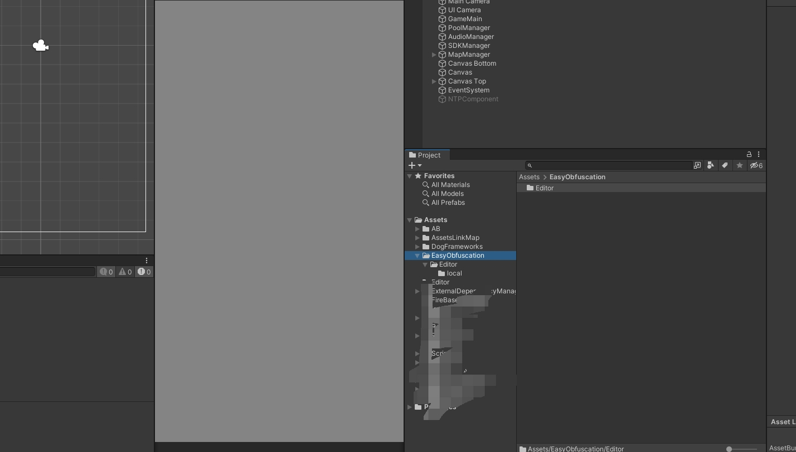

# Unity Global-metadata 源码映射文件加密

## Unitypackage download
[./plugins/EasyObfuscation.unitypackage](./plugins/EasyObfuscation.unitypackage)

### 使用方法
导入Unitypackage到项目中 输出Android工程打包 即可

### 验证加密是否成功
<!-- mp4格式 -->
<video id="video" controls="" preload="none" poster="封面">
      <source id="mp4" src="https://www.bilibili.com/video/BV1CQ4y137Gs?t=201.1" type="video/mp4">
</videos>

